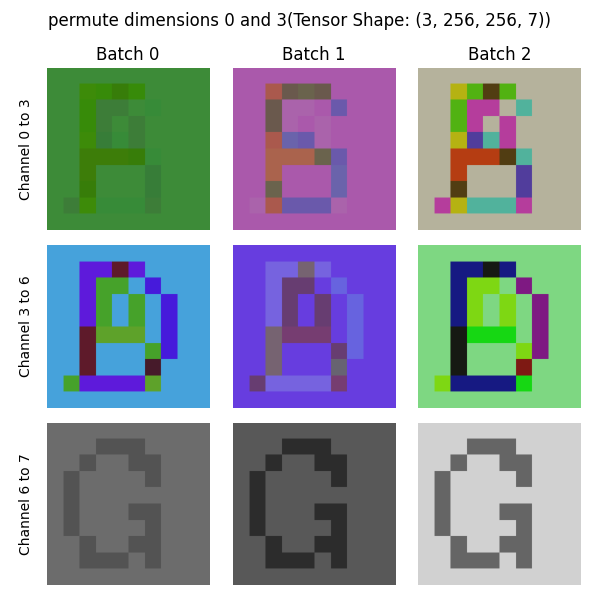

# Deinops

Deconstructed Einstein Operators

## Etymology

[Einsum](https://numpy.org/doc/2.1/reference/generated/numpy.einsum.html) -> [Einops](https://github.com/arogozhnikov/einops) (rearrange, reduce, repeat)

[Einops](https://github.com/arogozhnikov/einops) -> Deinops (permute, group(squeeze), ungroup(unsqueeze), reduce(select), repeat, slice, pad, fold, unfold)

## Visualizations

Given an original tensor of size [n h w c], where n = number of letters, h = height, w = width, c = color channels:

### Permute

#### Transpose

[n h w c] -> [n w h c]

#### Swap Batch And Color

[n h w c] -> [c w h n]

### Group

#### Group Width and Color

[n h w c] -> [n h (w c)]

#### Group Height and Color (Permute Group)

[n h w c] -> [n h c w] -> [n (h c) w]

### Reduce

#### Average Color

[n h w c] -> [n h w (1)] | mean 

#### Average Image

[n h w c] -> [(1) h w c] | mean 

#### Select

[n h w c] -> [(1) h w c] | index 0 

### Repeat (Unsqueeze Repeat Group)

[n h w c] -> [n h 1 w 1 c] -> [n h 1{repeat: 3} w 1{repeat: 4} 1 c] -> [n h*3 w*4 c]

### Slice

[n h w c] -> [n[1:-1] h[10:170] w[10:170] c]

### Pad

[n h w c] -> [n h{before: 30, after: 40} w{before: 20, after: 10} c]

### Unfold (Unfold Ungroup Permute Group)

Generalized Windowing

[n h w c] -> [n h{kernel_size: 160, stride:50} w{kernel_size: 160, stride:50} c] -> [n oh 160 ow 160 c] -> [n 160 160 oh ow c] -> [n 160 160 (oh ow c)] 

oh = (h - kernel_size) // stride + 1 -> (256 - 160) // 50 + 1 = 2

ow = (w - kernel_size) // stride + 1 -> (256 - 160) // 50 + 1 = 2

